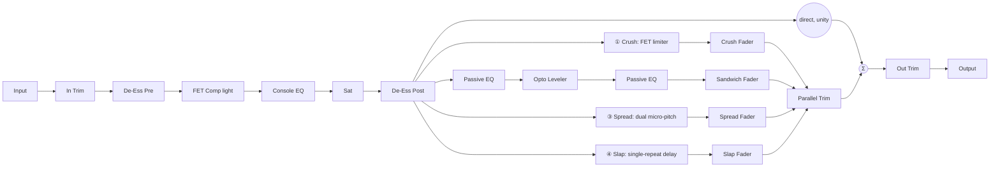

# Architecture (v2)

## Signal flow

The whole path is owned by `MiserereEngine` (`src/dsp/MiserereEngine.{h,cpp}`), independent
of `juce::AudioProcessor` so it is directly unit-testable. The engine processes the direct
path once, fans that single processed copy out into four pre-allocated bus buffers (unity
taps — the "post-fader unity send" the technique is built on), processes each bus, resolves
Mute/Audition into per-bus route gains, and sums the direct path plus busses back into the
host's buffer through per-sample-smoothed fader gains (each bus's fader additionally scaled
by the Parallel macro trim).

This is a **topology rewrite of v0.1.0** (see the design brief's "Why v1 was wrong" and
[ADR 0003](adr/0003-parallel-bus-topology.md), whose sample-alignment invariant carries
forward unchanged): v1 treated all four busses (including "Direct") as equal, independently
faded parallel chains, with the direct bus processed by default. v2 corrects the two errors
this produced: the direct/dry path is not one bus among four, it is the "channel" that always
sums at unity and feeds every send; and it is bit-transparent by default (every optional
section starts OFF), because the technique's entire premise is that the dry vocal's envelope
must survive underneath everything else that gets added.

## Phase discipline of the parallel busses (the central invariant, carried over from v1)

- **Busses ① Crush and ② Sandwich are sample-aligned, always.** Every module on them is
  either a pure per-sample gain computation (limiters, the leveler's gain multiply) or a
  minimum-phase IIR filter with no lookahead, no oversampling, no FIR linear-phase stages,
  and no internal delay.
- **Busses ③ Spread and ④ Slap are exempt by design** — they *are* delays, and Spread's
  micro-pitch shifting is itself built from modulated delay lines. See
  [ADR 0003](adr/0003-parallel-bus-topology.md).
- **Reported latency is always 0** (`tests/LatencyTests.cpp`): nothing on any bus is a
  compensation delay - Spread/Slap's delays are the musical effect itself.

`tests/NullAndAlignmentTests.cpp` proves the strongest version of this at neutral EQ
settings: Direct + Crush + Sandwich sum an impulse to a single aligned sample with nothing
else above −100 dBFS.

## Module map

| Directory | Responsibility |
|---|---|
| `src/dsp` | One class per module. `DeEsser`, `TapeSat` (+ shared `TapeSaturator` curve) are unchanged from v1, instantiated twice/once respectively on the Direct path. `FetCompressor` is the Direct path's simple threshold-based "FET Comp light" (insert voicing only - no drive/ALL-mode character). `FetCrush` is the new, separate input-drive/per-ratio-table/dual-rate-release/ALL-mode-plateau module for bus ① Crush. `ConsoleEq` is the Direct path's 1073-class grid, with the HPF folded in as a 3-pole (1st + 2nd order) cascade (the standalone v1 `Hpf` class is retired). `OptoLeveler` and `PassiveEq` (shared, two instances) implement bus ② Sandwich. `SpreadPitch` (new) and `SlapDelay` (rewritten for v2's single-repeat, feedback-fixed-at-0 design) implement busses ③/④. `MiserereEngine` wires everything into the v2 topology. `RealtimeCoefficients.h` holds the shared allocation-free IIR coefficient-update helpers, unchanged. |
| `src/params` | `ParameterIds.h` (frozen-as-of-v0.2.0 ID contract - the v1 IDs are gone, a deliberate breaking change pre-1.0) and `ParameterLayout.cpp` (APVTS layout: ranges, defaults, choice lists). Choice-index→value tables live here too, so the layout strings and the DSP mapping can never drift apart. |
| `src/PluginProcessor.*` | Host plumbing: APVTS wiring, `prepareToPlay`/`processBlock`/`reset`, oversized-block chunking, latency reporting (always 0), state save/load (tolerant of a v1 session's now-unknown IDs), Audition-exclusivity parameter listener. No DSP of its own. |
| `src/PluginEditor.*` | The same data-driven functional editor as v1 (unchanged architecture), rebuilt against the v2 parameter set. Custom GUI is M3. |

Dependency direction is one-way: `PluginEditor` → `params`, `PluginProcessor` → `params` +
`dsp`; `src/dsp` never depends upward.

## Design decisions

### Real-time-safe IIR coefficient updates

Unchanged from v1: all tunable filters recompute coefficients once per block from smoothed
parameter values via `juce::dsp::IIR::ArrayCoefficients` (stack arrays, zero allocation),
written in place into pre-allocated `Coefficients` objects by
`msrr::applyBiquadCoefficients()`/`applyFirstOrderCoefficients()`. Neutral EQ bands are
skipped structurally (a small dead zone around 0 dB) for the same fp-contract +
APVTS-denormalisation reasons documented in the v1 architecture notes (preserved in the
module headers).

### Two FET modules, not one with extra flags

v1 shared a single `FetCompressor` class between the Direct bus (threshold-based) and the
Smash bus (drive-based, all-buttons). v2 splits these into two classes because their control
paradigms genuinely don't share a parameter surface: `FetCompressor` is threshold-driven
insert voicing with no drive/ratio-table concept; `FetCrush` has no threshold knob at all, a
fixed per-ratio threshold/knee table, inverted-taper ballistics, a dual-rate
program-dependent release governed by a compression-duration integrator, and an ALL-mode
plateau (a steep ratio just above the knee giving back to a softer ratio past a fixed
overshoot "kink", plus a short extra attack lag exclusive to that mode - see `FetCrush.h`).

### Opto: raw-audio detector, three-path release

`OptoLeveler` was rewritten to remove any separate sidechain-smoothing detector stage ahead
of the ballistics (per the sourced "rectification and filtering... are not necessary"
finding) and to model the two-stage release as three parallel one-pole "cell conductance"
followers (fast/mid/slow release time constants, mid/slow scaled by a light-history
accumulator) combined via `max()` - the fast path dominates immediately after a short GR
event and decays out of the way, leaving the slower path(s) to carry a much longer tail after
sustained GR, which reproduces the documented "60 ms for 50%, then up to 15 s for the rest"
shape without an explicit two-branch switch. The static curve is an explicit lookup
(`OptoLeveler::staticCurveOutputDb`), not a fixed ratio.

### Passive EQ: resonant-shelf boost + peaking-dip cut, not two literal shelves

The documented "simultaneous boost+cut doesn't cancel" hardware behaviour does not fall out
of two independent digital low-shelf filters at the same corner (both reach full effect at
DC regardless of corner placement, so with cut's magnitude calibrated larger than boost's,
DC nets negative regardless of layout). `PassiveEq` instead models boost as a resonant low
shelf whose corner sits at the LF selector frequency (Q > 0.707, so it peaks at its own
corner) and cut as a broader, non-resonant peaking dip centred well above it (6× the
selector) - chosen and verified numerically during implementation to reproduce the
qualitative "bump below/at corner, dip in the low-mids" shape with comfortable margins. See
`docs/research-notes.md`'s Passive EQ section for the full reasoning and the caveat that this
is a deliberate simplification, not a literal passive-network simulation.

### M2 voicing pass: CRUSH's program-dependent colour

The v2 `FetCrush` implementation left the design brief's "Color" line only partly modelled:
the detector-ripple colouration that falls out of correct sample-rate gain computation was
already present, but the brief's second sentence - "add only mild class-A-style asymmetric
harmonics + transformer LF saturation, level-dependent, <0.5% THD at moderate GR" - was not
yet built (`docs/research-notes.md`'s FET section: "Less than 0.5% THD... at 1.1 seconds
release", framed as a side effect of the correct gain computer plus ballistics, not a baked-in
waveshaper). The M2 voicing pass adds exactly those two small stages, gated by a
`colourAmount` term that tracks the CURRENT gain reduction (0 at no GR, full strength at
`harmonicReferenceGrDb` = 12 dB of GR) so a quiet, uncompressed signal stays clean:

- **Class-A-style asymmetric term**: `asymmetryMaxAmount * colourAmount * x * |x|` added to
  the (clean) attenuated sample - an even-harmonic addition (still an odd function of `x`, so
  overall polarity is respected) that biases the two half-cycles differently, the classic
  single-ended gain-stage signature.
- **Transformer-style LF-selective saturation**: a one-pole lowpass (~150 Hz) tracks the LF
  band of the attenuated signal; only that band is driven into `tanh` (extra drive scaled by
  `colourAmount`), and only the resulting (also `colourAmount`-gated) delta is added back -
  broadband content above the cutoff is untouched. This reflects a real output transformer's
  core saturating more at low frequencies for a given level, rather than adding broadband
  distortion uniformly.

Both terms are engineering approximations tuned by ear and by measurement (regression-frozen
in `tests/FetCrushTests.cpp`'s `[colour]` cases: negligible THD at zero GR, THD growing with
GR, a mild ceiling at moderate GR, and measurably more added harmonic content on a low-frequency
tone than a high-frequency one at equal drive) - not a bench-measured match to any specific
hardware unit's THD curve. Processing cost: one extra `tanh` and one one-pole filter update per
sample per channel, alongside the module's existing per-sample `sqrt`/`log`/`pow` calls for the
envelope-to-dB/dB-to-gain conversions; a throwaway timing probe (20 000 stereo 512-sample
blocks, unoptimised Debug build, single core) processed ~213 s of audio in ~1.46 s (~146×
real-time), so the addition is not a meaningful CPU concern even before Release-build
optimisation.

### Spread: delay-line Doppler pitch shifting

`SpreadPitch` implements the classic "modulated delay, glide/crossfade" pitch-shift
technique: each voice is a single delay line read by two crossfading taps whose read
position glides at a rate proportional to the desired pitch ratio (read speed != write speed
= a pitch shift), each tap wrapping and resetting to the opposite phase inside a
raised-cosine crossfade window before it runs out of buffer. Two voices (~30 ms base, pitched
up; ~50 ms base, pitched down) are hard-panned L/R by default, blended toward centre by the
Width control.

### Slap: darkness baked into the single repeat, not a feedback loop

v2 fixes feedback at 0 (dropped as a parameter entirely) per the sourced finding that the
documented technique uses a single repeat whose darkness comes from the delay unit's own
character, not filtering/feedback. This is a structural change from v1's design: since there
is no feedback loop to voice progressively, the lowpass darkening and soft saturation are
applied once, directly to the one repeat.

### Neutral settings are structural bypasses

Every direct-path section defaults OFF and bypasses *structurally* (early return, block
untouched) rather than numerically: the two De-Essers and the Console EQ's HPF via enable
toggles, Sat and Console EQ's Drive at 0 dB, Console EQ's shelf/bell bands inside the dead
zone, FET Comp simply never called while its enable flag is off. This is what makes the
default-wire null test's −120 dBFS bar reachable with float processing - see
`tests/NullAndAlignmentTests.cpp` for the note on how that test's scope was interpreted
against the brief's non-floor default bus levels.

### Mute/Audition semantics and exclusivity

The engine resolves Mute/Audition at the summing stage: Mute always wins; if ANY bus is
auditioned, ONLY the auditioned (unmuted) bus(ses) reach the output, and the direct path
itself is excluded too (Audition isolates exactly what it names - the same signal-flow rule
as v1's Solo, renamed per the brief's framing that this technique should never be judged in
solo except for this explicit diagnostic purpose). Audition *exclusivity* is parameter-level
behaviour enforced in `PluginProcessor` via an APVTS listener with a reentrancy guard, same
pattern as v1's solo-exclusivity listener.

### Oversized-block guard, NaN/Inf policy

Unchanged from v1: `processBlock` chunks any buffer larger than the `prepareToPlay` promise
into engine-sized pieces (a real Release-safe clamp); the engine's summing stage sanitises
non-finite samples to 0; `reset()` clears every module's state (filters, envelopes, opto
memory, and now three delay lines - Slap's plus Spread's two micro-pitch voices).

## Latency

`MiserereEngine::getLatencySamples()` is a compile-time 0 and `PluginProcessor` reports it
unconditionally: busses ①/② are minimum-phase/causal with no lookahead, and busses ③/④'s
delays are the musical effect itself, not compensation artefacts.

## Deviations from the design brief

- The Passive EQ's non-cancelling LF boost+cut curve is a deliberate simplification of the
  documented passive-network interaction (resonant shelf + peaking dip, not two literal
  shelves) - see the design decision above and `docs/research-notes.md`.
- `sand_peakred` is implemented as an input-drive parameter into the fixed static curve
  (matching the hardware's Peak Reduction knob being itself an input gain into the cell),
  rather than a threshold shift - consistent with the brief's own framing of the module as
  drive-driven, not threshold-driven.
