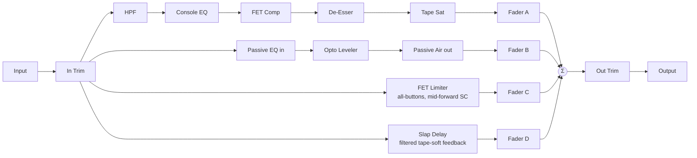

# Architecture

## Signal flow

The whole path is owned by `MiserereEngine` (`src/dsp/MiserereEngine.{h,cpp}`), independent of `juce::AudioProcessor` so it is directly unit-testable. The engine fans the trimmed input out into four pre-allocated bus buffers, processes each bus, resolves mute/solo into per-bus route gains, and sums the busses back into the host's buffer through per-sample-smoothed fader gains.

## Phase discipline of the parallel busses (the central invariant)

Summing several processed copies of the same signal is an interference experiment: any inter-bus time or phase offset turns the sum into a comb filter. Miserere's design rule, tested by the M1 guarantee suite (`tests/NullAndAlignmentTests.cpp`):

- **Busses A–C are sample-aligned, always.** Every module on them is either a pure gain computation (compressors, de-esser gain leg, saturator) or a minimum-phase IIR filter with no lookahead, no oversampling, no FIR linear-phase stages, and no internal delay. A sample enters and leaves each bus at the same index.
- **Bus D is exempt by design** — it *is* a delay, and it outputs the wet echo only. See [ADR 0003](adr/0003-parallel-bus-topology.md).
- **Reported latency is always 0** (`tests/LatencyTests.cpp`): nothing on any bus is a compensation delay.

Minimum-phase IIR filters do have their own frequency-dependent phase response — but since every bus that filters does so minimum-phase and the busses carry *different* processing intentionally, this is the same "two mics on one source" reality of any parallel mixing workflow. What the discipline rules out is *structural* misalignment: bulk sample offsets from lookahead/FIR/oversampling that would comb even a flat-settings sum. The impulse-alignment test proves the strongest version of this: with all modules neutral, A+B+C sum an impulse to a single sample with nothing else above −100 dBFS.

## Module map

| Directory | Responsibility |
|---|---|
| `src/dsp` | All audio-thread DSP, one class per module: `Hpf`, `ConsoleEq`, `FetCompressor` (serves Bus A *and*, with its character features enabled, Bus C), `DeEsser`, `TapeSat` (+ the shared `TapeSaturator` curve), `PassiveEq` (Bus B in-EQ and air-out as two instances of one class), `OptoLeveler`, `SlapDelay`, and `MiserereEngine` wiring them into the four-bus topology. `RealtimeCoefficients.h` holds the shared allocation-free IIR coefficient-update helpers. |
| `src/params` | `ParameterIds.h` (frozen ID contract) and `ParameterLayout.cpp` (APVTS layout: ranges, defaults, choice lists). The choice-index→value tables (`compRatioValues`, `busB*FreqHz`) live here too, so the layout strings and the DSP mapping can never drift apart. |
| `src/PluginProcessor.*` | Host plumbing: APVTS wiring, `prepareToPlay`/`processBlock`/`reset`, oversized-block chunking, latency reporting (always 0), state save/load, solo-exclusivity parameter listener. No DSP of its own. |
| `src/PluginEditor.*` | Functional v0.1 editor: data-driven rows of rotary sliders / combo boxes / toggles per bus, bound via APVTS attachments. Custom GUI is M3. |

Dependency direction is one-way: `PluginEditor` → `params`, `PluginProcessor` → `params` + `dsp`; `src/dsp` never depends upward.

## Design decisions

### Real-time-safe IIR coefficient updates

All tunable filters recompute coefficients once per block from smoothed parameter values via `juce::dsp::IIR::ArrayCoefficients` (stack arrays, zero allocation), written in place into pre-allocated `Coefficients` objects by `msrr::applyBiquadCoefficients()`. `Coefficients::make*` (which heap-allocates) appears nowhere on the audio thread.

Two subtleties in the helper and its callers, both load-bearing for the null guarantee:

1. **Normalisation divides by a0** rather than multiplying by its reciprocal: for a 0 dB RBJ shelf/peak the raw b and a coefficients are identical term-by-term, and `b/a0 == a/a0` bit-exactly only under division.
2. **Neutral EQ bands are skipped structurally** (a ±0.001 dB dead zone), for two reasons measured during M1: clang's default fp-contraction fuses the biquad's `(input*b1) - (output*a1)` into an fma whose 1-ulp residual recirculates through the feedback path (surfacing around −96 dB on low-frequency bands even with perfectly symmetric coefficients), and an APVTS "0 dB" that round-trips through normalise/snap comes back as ~−4·10⁻⁷ dB, so an exact-zero comparison never fires in a real host. The dead zone makes "EQ flat ⇒ bit-transparent" compiler- and host-independent.

### One FET class, two characters

The brief's Bus A "FET Comp" and Bus C "FET Limiter (all-buttons)" share one implementation (`FetCompressor`) with the character features off by default: a mid-forward sidechain (fixed +6 dB peak at 2 kHz applied to the *detector copy only* — the audio path is never filtered, preserving alignment), program-dependent release shortening (effective release ∝ 1/(1 + 0.12·GRdB), recomputed at block rate from the previous block's GR), input drive and output trim. Bus C runs at a fixed 20:1 / −20 dBFS voicing with Drive as the user's intensity control — matching how an all-buttons unit is actually driven.

The detector is a fast-attack/slow-release one-pole on the squared signal, i.e. effectively peak-reading — the static-curve tests model it as such.

### Opto two-stage release

`OptoLeveler` separates *level detection* (a symmetric ~5 ms one-pole, RMS-like) from *gain ballistics* (fixed 10 ms attack, variable release in the dB domain) and adds a third state: a light-history accumulator (~1.5 s time constant) integrating recent gain reduction. The release time interpolates from the ~60 ms fast stage to the ~600 ms slow stage as history accumulates — brief GR recovers fast, sustained GR releases lazily, which is the photocell-memory behaviour the brief specifies and `tests/OptoLevelerTests.cpp` measures directly (long-history release ≥ 2× slower).

### Slap loop stability

Bus D's feedback path is `HP → LP → tanh soft saturation → ×feedback (≤ 0.3)`. The saturator is strictly bounded and approximately unity-gain at small signal (nominal-level-compensated, see `TapeSaturator.h`), so the loop's round-trip gain is ≤ ~0.3 plus filter losses — geometric decay, unconditionally stable, verified by 10 s of full-scale noise at maximum feedback. Delay-time changes ride a deliberately slow (100 ms) smoother, giving a mild tape-style pitch slur instead of zipper artefacts; the delay line is allocated once in `prepare()` at full 180 ms capacity and cleared by `reset()` (the M1 reset guarantee explicitly covers it).

### Neutral settings are structural bypasses

Every module the null test declares "neutral" bypasses *structurally* (early return, block untouched) rather than numerically: HPF and De-Esser via their enable toggles, Tape Sat at 0 dB drive, Opto at 0% peak reduction, EQ bands inside the dead zone. The FET comp's identity at threshold 0 dB is arithmetic but exact (clamped-to-zero overshoot ⇒ gain factor exactly 1.0f). This is what makes the −120 dBFS null bar reachable with float processing.

### Mute/Solo semantics and solo exclusivity

The engine resolves mute/solo at the summing stage into 0/1 route gains (console semantics: mute always wins; any solo isolates the soloed, unmuted busses), while every bus's DSP keeps running so envelopes/filters/delay stay continuous and unmuting never pops. Solo *exclusivity* (engaging one solo releases the others — the brief's "exclusive-OR") is parameter-level behaviour, enforced in `PluginProcessor` by an APVTS listener with a reentrancy guard. Known limitation: if a host automates two solos on within the same gesture, the listener resolves them in callback order; the engine remains well-defined for any flag combination regardless.

### Oversized-block guard

`processBlock` chunks any buffer larger than the `prepareToPlay` promise into engine-sized pieces — a real Release-safe clamp (asserts compile out), which still processes all audio rather than truncating. The engine additionally trims defensively against its own buffer capacity as a last resort. `tests/RobustnessTests.cpp` proves both the safety and the fact that the null property survives chunking.

### NaN/Inf policy

The engine's summing stage sanitises non-finite samples to 0, guaranteeing finite *output* even under hostile input; `reset()` clears every module's state (filters, envelopes, opto history, the slap delay line) so processing *recovers* after poisoning — the two halves of the M1 guarantee, tested with both NaN and Inf sweeps.

## Latency

`MiserereEngine::getLatencySamples()` is a compile-time 0 and `PluginProcessor` reports it unconditionally: busses A–C are minimum-phase/causal with no lookahead, and Bus D's delay is the musical effect itself, not a compensation artefact.

## Deviations from the design brief

- The brief's Bus A FET Comp bullet does not list a threshold parameter, but the M1 null-test guarantee explicitly exercises one ("comp threshold at max") — `busA_compThreshold` (−40…0 dB) exists accordingly.
- Bus C's threshold is fixed at −20 dBFS (not a parameter): the all-buttons character is driven via input Drive, per the brief's parameter list for that bus.
