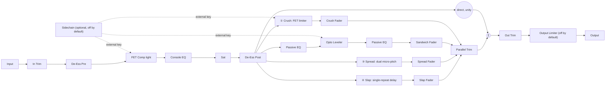

# Architecture (v2)

## Signal flow

```mermaid
flowchart LR
    KEY["Sidechain (optional, off by default)"] -.->|external key| CRUSH
    KEY -.->|external key| SAND_OPTO
    KEY -.->|external key| DP_FET
    IN[Input] --> TRIM_IN[In Trim]
    TRIM_IN --> DP_DSP[De-Ess Pre] --> DP_FET[FET Comp light] --> DP_EQ[Console EQ] --> DP_SAT[Sat] --> DP_DSPOST[De-Ess Post]
    DP_DSPOST --> DIRECT_SUM((direct, unity))
    DP_DSPOST --> CRUSH[① Crush: FET limiter] --> CRUSH_FADER[Crush Fader]
    DP_DSPOST --> SAND_PRE[Passive EQ] --> SAND_OPTO[Opto Leveler] --> SAND_POST[Passive EQ] --> SAND_FADER[Sandwich Fader]
    DP_DSPOST --> SPREAD[③ Spread: dual micro-pitch] --> SPREAD_FADER[Spread Fader]
    DP_DSPOST --> SLAP[④ Slap: single-repeat delay] --> SLAP_FADER[Slap Fader]
    DIRECT_SUM --> SUM((Σ))
    CRUSH_FADER --> PARALLEL_TRIM[Parallel Trim] --> SUM
    SAND_FADER --> PARALLEL_TRIM
    SPREAD_FADER --> PARALLEL_TRIM
    SLAP_FADER --> PARALLEL_TRIM
    SUM --> TRIM_OUT[Out Trim] --> LIMITER["Output Limiter (off by default)"] --> OUT[Output]
```

The whole path is owned by `MiserereEngine` (`src/dsp/MiserereEngine.{h,cpp}`), independent
of `juce::AudioProcessor` so it is directly unit-testable. The engine processes the direct
path once, fans that single processed copy out into four pre-allocated bus buffers (unity
taps — the "post-fader unity send" the technique is built on), processes each bus, resolves
Mute/Audition into per-bus route gains, and sums the direct path plus busses back into the
host's buffer through per-sample-smoothed fader gains (each bus's fader additionally scaled
by the Parallel macro trim).

This is a **topology rewrite of v0.1.0** (see the design brief's "Why v1 was wrong" and
[ADR 0003](adr/0003-parallel-bus-topology.md), whose sample-alignment invariant carries
forward unchanged): v1 treated all four busses (including "Direct") as equal, independently
faded parallel chains, with the direct bus processed by default. v2 corrects the two errors
this produced: the direct/dry path is not one bus among four, it is the "channel" that always
sums at unity and feeds every send; and it is bit-transparent by default (every optional
section starts OFF), because the technique's entire premise is that the dry vocal's envelope
must survive underneath everything else that gets added.

## Phase discipline of the parallel busses (the central invariant, carried over from v1)

- **Busses ① Crush and ② Sandwich are sample-aligned, always.** Every module on them is
  either a pure per-sample gain computation (limiters, the leveler's gain multiply) or a
  minimum-phase IIR filter with no lookahead, no oversampling, no FIR linear-phase stages,
  and no internal delay.
- **Busses ③ Spread and ④ Slap are exempt by design** — they *are* delays, and Spread's
  micro-pitch shifting is itself built from modulated delay lines. See
  [ADR 0003](adr/0003-parallel-bus-topology.md).
- **Reported latency is always 0** (`tests/LatencyTests.cpp`): nothing on any bus is a
  compensation delay - Spread/Slap's delays are the musical effect itself.
- **The output limiter (issue #24) is causal and lookahead-free too**, which is precisely
  why it guarantees a SAMPLE-peak ceiling rather than a true-peak one: true-peak detection
  needs an oversampled reconstruction, whose filters are delays, and honouring their verdict
  means holding the audio back by that delay - lookahead under another name.
  `tests/OutputLimiterTests.cpp` measures the inter-sample overshoot that therefore remains
  (8x windowed-sinc reconstruction) and regression-freezes the figure instead of pretending
  it is absent.

`tests/NullAndAlignmentTests.cpp` proves the strongest version of this at neutral EQ
settings: Direct + Crush + Sandwich sum an impulse to a single aligned sample with nothing
else above −100 dBFS.

## Module map

| Directory | Responsibility |
|---|---|
| `src/dsp` | One class per module. `DeEsser`, `TapeSat` (+ shared `TapeSaturator` curve) are unchanged from v1, instantiated twice/once respectively on the Direct path. `FetCompressor` is the Direct path's simple threshold-based "FET Comp light" (insert voicing only - no drive/ALL-mode character). `FetCrush` is the new, separate input-drive/per-ratio-table/dual-rate-release/ALL-mode-plateau module for bus ① Crush. `ConsoleEq` is the Direct path's 1073-class grid, with the HPF folded in as a 3-pole (1st + 2nd order) cascade (the standalone v1 `Hpf` class is retired). `OptoLeveler` and `PassiveEq` (shared, two instances) implement bus ② Sandwich. `SpreadPitch` (new) and `SlapDelay` (rewritten for v2's single-repeat, feedback-fixed-at-0 design) implement busses ③/④. `OutputLimiter` (v0.7.0, issue #24) is the final safety stage after the Out Trim - zero-latency, no lookahead, sample-peak ceiling, OFF by default and a bit-exact bypass while off. `MiserereEngine` wires everything into the v2 topology. `RealtimeCoefficients.h` holds the shared allocation-free IIR coefficient-update helpers, unchanged. |
| `src/params` | `ParameterIds.h` (frozen-as-of-v0.2.0 ID contract - the v1 IDs are gone, a deliberate breaking change pre-1.0) and `ParameterLayout.cpp` (APVTS layout: ranges, defaults, choice lists). Choice-index→value tables live here too, so the layout strings and the DSP mapping can never drift apart. |
| `src/PluginProcessor.*` | Host plumbing: APVTS wiring, `prepareToPlay`/`processBlock`/`reset`, oversized-block chunking, latency reporting (always 0), state save/load (tolerant of a v1 session's now-unknown IDs), Audition-exclusivity parameter listener, and the optional external-sidechain bus (issue #23 - disabled by default; the audio path is taken as the MAIN bus's view of the host buffer so the key channels are never processed as audio, and the key is chunked in lockstep with the audio). No DSP of its own. |
| `src/PluginEditor.*` | The same data-driven functional editor as v1 (unchanged architecture), rebuilt against the v2 parameter set. Custom GUI is M3. |

Dependency direction is one-way: `PluginEditor` → `params`, `PluginProcessor` → `params` +
`dsp`; `src/dsp` never depends upward.

## Design decisions

### Real-time-safe IIR coefficient updates

Unchanged from v1: all tunable filters recompute coefficients once per block from smoothed
parameter values via `juce::dsp::IIR::ArrayCoefficients` (stack arrays, zero allocation),
written in place into pre-allocated `Coefficients` objects by
`msrr::applyBiquadCoefficients()`/`applyFirstOrderCoefficients()`. Neutral EQ bands are
skipped structurally (a small dead zone around 0 dB) for the same fp-contract +
APVTS-denormalisation reasons documented in the v1 architecture notes (preserved in the
module headers).

### Two FET modules, not one with extra flags

v1 shared a single `FetCompressor` class between the Direct bus (threshold-based) and the
Smash bus (drive-based, all-buttons). v2 splits these into two classes because their control
paradigms genuinely don't share a parameter surface: `FetCompressor` is threshold-driven
insert voicing with no drive/ratio-table concept; `FetCrush` has no threshold knob at all, a
fixed per-ratio threshold/knee table, inverted-taper ballistics, a dual-rate
program-dependent release governed by a compression-duration integrator, and an ALL-mode
plateau (a steep ratio just above the knee giving back to a softer ratio past a fixed
overshoot "kink", plus a short extra attack lag exclusive to that mode - see `FetCrush.h`).

### Opto: raw-audio detector, three-path release (superseded in v0.5.0 - see below)

`OptoLeveler` was rewritten to remove any separate sidechain-smoothing detector stage ahead
of the ballistics (per the sourced "rectification and filtering... are not necessary"
finding) and to model the two-stage release as three parallel one-pole "cell conductance"
followers (fast/mid/slow release time constants, mid/slow scaled by a light-history
accumulator) combined via `max()` - the fast path dominates immediately after a short GR
event and decays out of the way, leaving the slower path(s) to carry a much longer tail after
sustained GR, which reproduces the documented "60 ms for 50%, then up to 15 s for the rest"
shape without an explicit two-branch switch. The static curve is an explicit lookup
(`OptoLeveler::staticCurveOutputDb`), not a fixed ratio.

### Passive EQ: resonant-shelf boost + peaking-dip cut (superseded in v0.5.0 - see below)

The documented "simultaneous boost+cut doesn't cancel" hardware behaviour does not fall out
of two independent digital low-shelf filters at the same corner (both reach full effect at
DC regardless of corner placement, so with cut's magnitude calibrated larger than boost's,
DC nets negative regardless of layout). `PassiveEq` instead models boost as a resonant low
shelf whose corner sits at the LF selector frequency (Q > 0.707, so it peaks at its own
corner) and cut as a broader, non-resonant peaking dip centred well above it (6× the
selector) - chosen and verified numerically during implementation to reproduce the
qualitative "bump below/at corner, dip in the low-mids" shape with comfortable margins. See
`docs/research-notes.md`'s Passive EQ section for the full reasoning and the caveat that this
is a deliberate simplification, not a literal passive-network simulation.

### M2 voicing pass: CRUSH's program-dependent colour

The v2 `FetCrush` implementation left the design brief's "Color" line only partly modelled:
the detector-ripple colouration that falls out of correct sample-rate gain computation was
already present, but the brief's second sentence - "add only mild class-A-style asymmetric
harmonics + transformer LF saturation, level-dependent, <0.5% THD at moderate GR" - was not
yet built (`docs/research-notes.md`'s FET section: "Less than 0.5% THD... at 1.1 seconds
release", framed as a side effect of the correct gain computer plus ballistics, not a baked-in
waveshaper). The M2 voicing pass adds exactly those two small stages, gated by a
`colourAmount` term that tracks the CURRENT gain reduction (0 at no GR, full strength at
`harmonicReferenceGrDb` = 12 dB of GR) so a quiet, uncompressed signal stays clean:

- **Class-A-style asymmetric term**: `asymmetryMaxAmount * colourAmount * x * |x|` added to
  the (clean) attenuated sample - an even-harmonic addition (still an odd function of `x`, so
  overall polarity is respected) that biases the two half-cycles differently, the classic
  single-ended gain-stage signature.
- **Transformer-style LF-selective saturation**: a one-pole lowpass (~150 Hz) tracks the LF
  band of the attenuated signal; only that band is driven into `tanh` (extra drive scaled by
  `colourAmount`), and only the resulting (also `colourAmount`-gated) delta is added back -
  broadband content above the cutoff is untouched. This reflects a real output transformer's
  core saturating more at low frequencies for a given level, rather than adding broadband
  distortion uniformly.

Both terms are engineering approximations tuned by ear and by measurement (regression-frozen
in `tests/FetCrushTests.cpp`'s `[colour]` cases: negligible THD at zero GR, THD growing with
GR, a mild ceiling at moderate GR, and measurably more added harmonic content on a low-frequency
tone than a high-frequency one at equal drive) - not a bench-measured match to any specific
hardware unit's THD curve. Processing cost: one extra `tanh` and one one-pole filter update per
sample per channel, alongside the module's existing per-sample `sqrt`/`log`/`pow` calls for the
envelope-to-dB/dB-to-gain conversions; a throwaway timing probe (20 000 stereo 512-sample
blocks, unoptimised Debug build, single core) processed ~213 s of audio in ~1.46 s (~146×
real-time), so the addition is not a meaningful CPU concern even before Release-build
optimisation.

### Spread: delay-line Doppler pitch shifting

`SpreadPitch` implements the classic "modulated delay, glide/crossfade" pitch-shift
technique: each voice is a single delay line read by two crossfading taps whose read
position glides at a rate proportional to the desired pitch ratio (read speed != write speed
= a pitch shift), each tap wrapping and resetting to the opposite phase inside a
raised-cosine crossfade window before it runs out of buffer. Two voices (~30 ms base, pitched
up; ~50 ms base, pitched down) are hard-panned L/R by default, blended toward centre by the
Width control.

### Slap: darkness baked into the single repeat, not a feedback loop

v2 fixes feedback at 0 (dropped as a parameter entirely) per the sourced finding that the
documented technique uses a single repeat whose darkness comes from the delay unit's own
character, not filtering/feedback. This is a structural change from v1's design: since there
is no feedback loop to voice progressively, the lowpass darkening and soft saturation are
applied once, directly to the one repeat.

### Neutral settings are structural bypasses

Every direct-path section defaults OFF and bypasses *structurally* (early return, block
untouched) rather than numerically: the two De-Essers and the Console EQ's HPF via enable
toggles, Sat and Console EQ's Drive at 0 dB, Console EQ's shelf/bell bands inside the dead
zone, FET Comp simply never called while its enable flag is off. This is what makes the
default-wire null test's −120 dBFS bar reachable with float processing - see
`tests/NullAndAlignmentTests.cpp` for the note on how that test's scope was interpreted
against the brief's non-floor default bus levels.

### Mute/Audition semantics and exclusivity

The engine resolves Mute/Audition at the summing stage: Mute always wins; if ANY bus is
auditioned, ONLY the auditioned (unmuted) bus(ses) reach the output, and the direct path
itself is excluded too (Audition isolates exactly what it names - the same signal-flow rule
as v1's Solo, renamed per the brief's framing that this technique should never be judged in
solo except for this explicit diagnostic purpose). Audition *exclusivity* is parameter-level
behaviour enforced in `PluginProcessor` via an APVTS listener with a reentrancy guard, same
pattern as v1's solo-exclusivity listener.

### Oversized-block guard, NaN/Inf policy

Unchanged from v1: `processBlock` chunks any buffer larger than the `prepareToPlay` promise
into engine-sized pieces (a real Release-safe clamp); the engine's summing stage sanitises
non-finite samples to 0; `reset()` clears every module's state (filters, envelopes, opto
memory, and now three delay lines - Slap's plus Spread's two micro-pitch voices).

## v0.5.0 "Circuit Engines" pass

The four design decisions above marked "superseded" describe how v0.2.0-v0.4.0 approximated
their circuits with chosen filter shapes and tabulated curves. v0.5.0 replaces those
approximations with models derived from the circuits themselves. The engineering constraint
that shaped every choice below is ADR 0003: the plugin reported 0 latency and must still
report 0 latency, which rules out oversampling as the anti-aliasing tool.

### Residual-form ADAA, and why not the textbook form

First-order antiderivative anti-aliasing (Parker/Zavalishin/Le Bivic, DAFx-16) renders a
memoryless curve `f` as `(F(x[n]) - F(x[n-1])) / (x[n] - x[n-1])`. Applied whole-curve that is
unusable here: its LINEAR-regime response is exactly `(x[n] + x[n-1]) / 2`, i.e. a half-sample
delay convolved with a `cos(pi*f/fs)` lowpass (-11.7 dB at 20 kHz at 48 k). On the SANDWICH
bus, whose post-attenuator colour stage is always on, that smears a single-sample impulse
across two samples and breaks the parallel-bus alignment invariant outright; on the direct
path it imposes an uncompensated, sample-rate-dependent HF droop whenever drive is up.

`AdaaSaturator.h` therefore decomposes every curve into an exactly-aligned linear part plus a
nonlinear residual, `f(x) = k*x + r(x)` with `k = f'(0)`, and applies ADAA only to `r`. ADAA1
is linear in the curve, so the alias suppression is identical to the whole-curve form - the
residual carries all of the distortion products - while the half-sample smear now applies only
to those products and never to the signal. Consequences that are asserted rather than assumed:
small-signal response flat within 0.1 dB to 20 kHz, group delay 0, and the pre-existing
impulse-alignment tests pass unmodified.

One stage is deliberately EXEMPT: the opto's always-on post-attenuator colour. Even in
residual form it would put ~2.8e-5 onto the neighbouring sample at the alignment tests'
operating point, above their 1e-5 bar, while at its fixed low drive the stage is near-linear
anyway. Its aliasing contribution is measured rather than assumed (guarded at <= -80 dBFS in
`tests/AliasingTests.cpp`); a failing guard is an escalation, never a silent retrofit, because
retrofitting it would break bus alignment.

Numerical note worth keeping: the tanh-family residuals are evaluated from the Taylor series
of `tanh(b + w)` (generated by the Riccati recursion) below `|w| = 0.1` rather than in closed
form. The closed form subtracts an O(1/g) constant from a residual of order `w^3`, and the
ADAA divided difference then amplifies that cancellation noise by `1 / (x[n] - x[n-1])`. That
is not academic: it is what held the console EQ's near-zero-drive null at -63 dBFS instead of
-105 dBFS.

### CRUSH: feedback-FET engine

`FetCrush`'s detector is now a genuine feedback loop - the sidechain is driven from the bus
OUTPUT, through a rectifier into a single-capacitor RC network with the attack pot in the
charge path and the release pot in the discharge path. Two fixed-point iterations per sample
make the fastest attack settings act sub-sample at 44.1/48 k, which a one-pole coefficient
structurally cannot do. The FET divider cell carries an imperfect square-law cancellation term
whose second-harmonic content grows with gain-reduction depth.

What this buys is that the behaviours this limiter class is known for are now emergent rather
than scripted: ratio creep, attack/release coupling, knee ordering across the ratio row, and
the all-buttons overshoot. The hand-built dual-rate release blend and duration integrator are
deleted. Ratio settings are discrete tuples and all-buttons is the fifth tuple - never an
interpolation - crossfaded over 10 ms on a switch.

### SANDWICH: photocell carrier model

`OptoCell.h` replaces the three-path `max()` release and the static-curve lookup with an
electroluminescent-panel luminance law feeding a two-state carrier-density ODE (semi-implicit
Euler, double-precision states). The EL law is an even function of its input, so the sidechain
is deliberately NOT rectified and NOT decimated: the ripple that survives is what produces the
LF thickening this module is used for.

Release rate falls out of carrier density, which is why a two-stage release appears without
any explicit time constants; the trap state gives the cell memory, so longer and deeper gain
reduction releases more slowly. The static compression curve is emergent - there is no ratio
parameter because there is no ratio in the circuit. Carrier states are never smoothed (they
smooth themselves) and reset to dark equilibrium.

### Passive EQ and console EQ: matched filters and component values

Two separate changes. First, the cramped filters - the console EQ's 12 kHz shelf and the
passive EQ's HF bell and shelf - are now magnitude-matched (Vicanek) rather than bilinear, so
the top octave keeps its analog shape at 44.1 k instead of being squeezed toward Nyquist.
Sections at or below ~1.6 kHz stay bilinear, where cramping is negligible.

Second, the passive EQ's LF boost/cut network is no longer the "resonant shelf + peaking dip"
approximation described above: `PassiveEq::computeLfNetworkCoefficients` evaluates the
hardware ladder's exact second-order transfer function from component values and
bilinear-transforms it. The non-cancelling boost+cut curve, the cut corner sitting above the
boost corner, and the HF bell's gain/bandwidth coupling are now consequences of the network
rather than of chosen filter parameters. One honest side effect: a ~20 dB first-order-style
cut necessarily places its zero and pole a decade apart, so the LF Cut is genuinely broad
(about 1.6 dB still showing at 2 kHz at full cut on the 100 Hz selector). That is the
hardware's behaviour and the tests now pin it as such.

That ladder is second-order only while both LF pots are off their stops. Both quadratic
coefficients carry the factor `R_cut*C_lo1 * R_boost*C_lo2`, so a pot at exactly 0 removes one
reactive element and leaves a genuinely first-order network - which is the normal case, not an
edge case: each shipped instance drives exactly one pot (Sand Pre cuts, Sand Post boosts).
Transforming the degenerate quadratic at second order regardless is algebraically valid but
numerically not, because numerator and denominator then both factor as `(z+1)*(first order)`:
a pole and a zero exactly at Nyquist that are supposed to cancel and, once rounded to float,
no longer do. What survives is a `z = -1` mode sitting on the unit circle (measured radius
0.99999998 boost-only, 1.00000002 cut-only) that rings forever once excited - the SANDWICH
bus's ~3e-7 resting floor. `computeLfNetworkCoefficients` therefore divides the `(z+1)` out
analytically and emits the first-order transform with exact-zero second-order coefficients.
Responses agree with the previous rendering to within 2e-6 dB over 10 Hz-23 kHz, and the bus
now rests at exact zero like the other three. Note the recurrence: this is the same undamped
Nyquist pole the iron integrator below had to be discretised around.

### Console EQ drive: flux-domain iron

The ad-hoc squared even-harmonic term is replaced by a transformer model: a leaky flux
integrator into a DC-biased saturator and back out through the integrator's inverse. Because
flux scales as voltage over frequency, third-harmonic content rises toward LF automatically
(measured +12 dB from 100 Hz to 50 Hz) with no hand-drawn frequency weighting, and the DC
premagnetisation sets the second-to-third-harmonic ratio (measured 0.88 at hot drive).

Discretisation deviates from the brief deliberately. The brief specified a trapezoidal
integrator/differentiator pair, but the bilinear integrator's exact inverse carries a pole at
z = -1 - an undamped Nyquist resonance. Damping it both breaks the exactness of the pairing
and leaves ~34 dB of gain on any arithmetic noise reaching it. The pair is therefore
impulse-invariant: `u[n] = a*u[n-1] + G*x[n]` with the two-tap FIR inverse
`(u[n] - a*u[n-1]) / G`, which is pole-free AND an exact inverse in the linear region - which
is the property the drive-to-zero null assertion is actually about.

### SLAP: transport voicing

Cubic Hermite fractional reads replace linear interpolation (linear is a fraction-dependent
lowpass that pumps with modulation). The record-side saturator moves ahead of the delay write
rather than sitting lumped on the tap, which is audible on repeats-versus-input brightness and
costs nothing. `FlutterGenerator.h` supplies wow/flutter as two quasi-periodic oscillators
plus a leaky random-walk drift, each with slow independent AM/PM wander so nothing is
locked-periodic; it runs at control rate with a deterministically seeded xorshift RNG so
renders are reproducible, and at depth 0 it is structurally off and never advances the RNG.

Worth recording because it is an easy mistake to repeat: a one-pole noise filter written as
`y = a*y + (1-a)*x` has output variance `(1-a)/(1+a)` of its input's, which at a 2 s time
constant is -41 dB. Written that way the specified +-10 % wander lands at +-0.05 % and the
generator is effectively locked-periodic. The filter is normalised by `sqrt((1+a)/(1-a))`.

### Click-free routing

Bus route gains ride 3 ms linear ramps instead of switching between 0 and 1. The ramp lands on
exact 0.0f/1.0f, so a muted bus still contributes exact zeros and the bit-exact sum invariants
continue to hold once the ramp has settled.

## Latency

`MiserereEngine::getLatencySamples()` is a compile-time 0 and `PluginProcessor` reports it
unconditionally: busses ①/② are minimum-phase/causal with no lookahead, and busses ③/④'s
delays are the musical effect itself, not compensation artefacts.

## Deviations from the design brief

- v0.5.0: the console EQ's flux integrator/differentiator pair is discretised
  impulse-invariant rather than trapezoidally, because the trapezoidal inverse carries an
  undamped pole at z = -1 - see the "Console EQ drive: flux-domain iron" section above.
- v0.5.0: `tests/SpreadPitchTests.cpp`'s interpolation and ripple assertions probe a SET of
  frequencies rather than one. A two-tap crossfading Doppler shifter sums one delay line read
  at a fixed offset, so a single-frequency measurement reports which tooth of a 33 Hz comb the
  probe landed on (measured spread: -2.37 to +0.62 dB for the same nominal quantity). The
  brief's bars are unchanged; only the estimator is made robust.
- The Passive EQ's non-cancelling LF boost+cut curve is a deliberate simplification of the
  documented passive-network interaction (resonant shelf + peaking dip, not two literal
  shelves) - see the design decision above and `docs/research-notes.md`.
- `sand_peakred` is implemented as an input-drive parameter into the fixed static curve
  (matching the hardware's Peak Reduction knob being itself an input gain into the cell),
  rather than a threshold shift - consistent with the brief's own framing of the module as
  drive-driven, not threshold-driven.
